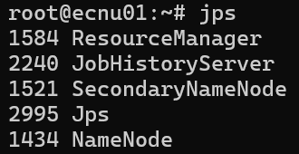
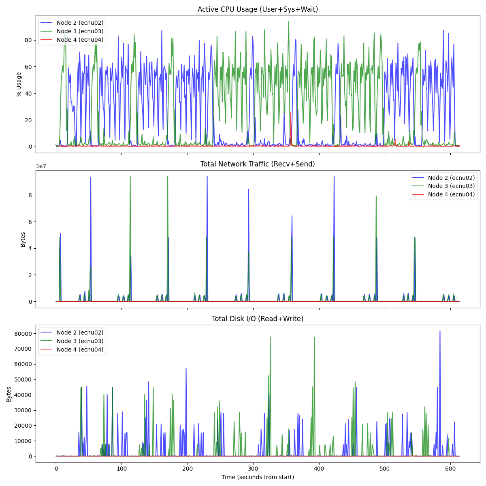
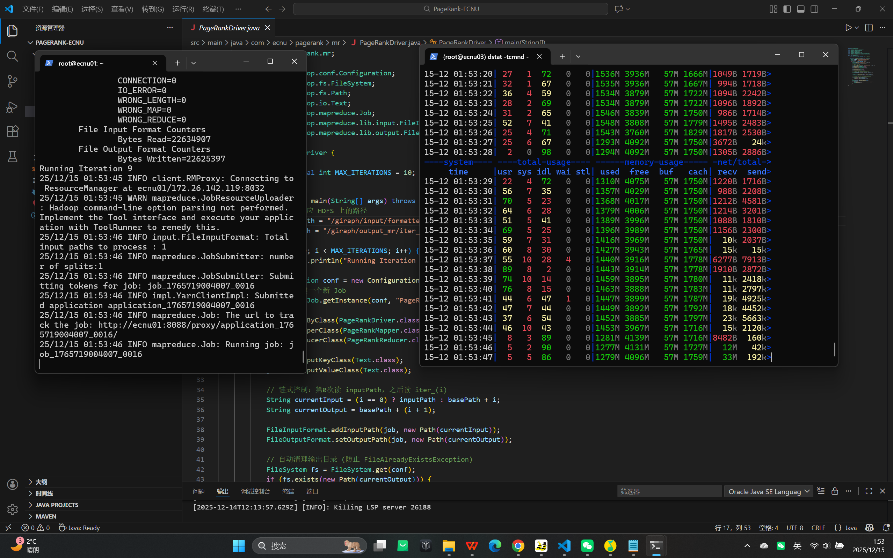
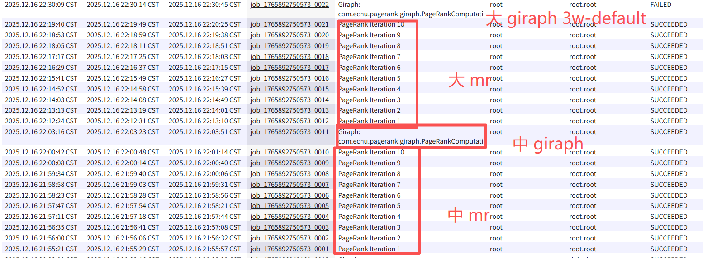
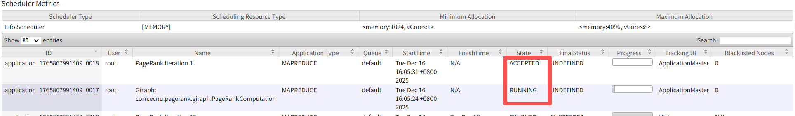
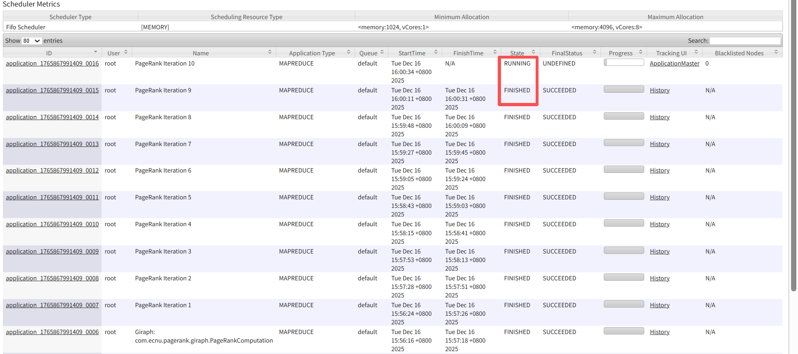

# 2025大规模数据处理系统作业_16_H
```
.
├── code/                                # MapReduce与Giraph代码与环境文件等
├── dstat-测试调优/                       # 大数据集图计算出现的内存溢出与死锁现象监测数据文件等
├── dstat-最终/                           # 各实验的监测数据文件
├── 三个调度实验主要步骤_以fifo为例.md     # 三个调度做两个计算框架算法的主要实验代码（以FIFO为例）
├── 全部实验结果及分析.pdf                # 3种调度器 × 3种数据集 × 2种框架的所有实验结果与分析
├── README_环境.md                        # 项目环境配置文档
└── README.md                            # 项目核心文档
```
## 研究目的
比较 Giraph 和 MapReduce 运行 PageRank 算法的差异

## 研究内容
1.  **算法与模型对比**：对比分析 Giraph (基于内存的 BSP 模型) 和 MapReduce (基于磁盘 Shuffle 的 MR 模型) 在执行 PageRank 等图迭代计算任务时的编程范式与数据流差异。
2.  **性能与资源效率分析**：深入探究两者在**数据通信方式**（消息传递 vs 磁盘IO）、**同步机制**（Superstep 同步屏障 vs 阶段性 Shuffle）及**迭代开销**方面的不同，量化分析这些差异对作业执行时间、CPU 利用率及网络吞吐量的影响。
3.  **调度策略与资源竞争研究**：结合 YARN 的三种调度器（FIFO, Capacity, Fair），探讨不同资源分配策略对长时运行的图计算作业（Giraph）与短作业（MapReduce）共存时的影响，重点分析**排头阻塞 (Head-of-line blocking)** 现象及多租户环境下的资源竞争问题。
4.  **系统稳定性与可扩展性探讨**：针对分布式环境下的**资源死锁 (Resource Deadlock)** 与内存溢出 (OOM) 问题进行实验排查，分析 Giraph 在受限资源下的容器分配机制及其调优策略。

## 实验
1.  **算法实现**：分别基于 Giraph 和 MapReduce 框架实现 PageRank 算法，验证分布式计算逻辑的正确性。
2.  **多维性能评估**：构建“不同数据规模 × 不同计算框架”的实验矩阵，宏观对比两者在作业执行效率、内存占用及网络 I/O 特征上的差异。
3.  **调度特性测试**：模拟高并发与资源抢占场景，评估 FIFO、Capacity 和 Fair 三种调度器在处理长短作业混合负载时的表现及资源隔离效果。
4.  **瓶颈分析与调优**：针对大图计算过程中出现的内存溢出与死锁现象进行诊断，验证关键参数调优对系统稳定性的影响。

### 实验环境
#### 1. 硬件配置
本次实验部署在分布式集群上，包含 **1 个主节点** 和 **3 个子节点**，满足节点数 (>=3) 的要求。
* **节点拓扑**：
    * **Master**: `ecnu01` (NameNode, ResourceManager)
    * **Slaves**: `ecnu02`, `ecnu03`, `ecnu04` (DataNode, NodeManager)
* **单节点配置**：
    * **CPU**: 4 核 (vCPU)
    * **内存**: 8 GiB
    * **操作系统**: Ubuntu 24.04 64位
    * **网络带宽**: 100 Mbps (峰值)
    * **区域**: 华东2 (上海) 可用区 B

#### 2. 软件配置
* **操作系统**：Linux
* **JDK 版本**：Java 8 OpenJDK
* **Hadoop 版本**：2.7.3 (HDFS + YARN)
* **Giraph 版本**：1.3.0-SNAPSHOT (针对 Hadoop 2.7.3 重新编译，已解决 Protobuf 2.5.0 冲突)
* **Build Tool**：Maven 3.x

### 实验负载
本次实验使用 PageRank 算法作为核心工作负载，测试数据集分为两组：
1.  **逻辑验证数据集 (`init_graph.txt`)**
    * **规模**：小规模手动构建数据（约 10 个节点）。
    * **格式**：Tab 分隔文本 (TSV)，`NodeID [TAB] PR_Value [TAB] OutLink1,OutLink2...`。
    * **用途**：用于验证 MapReduce 链式作业的迭代逻辑正确性及收敛性。
2.  **性能测试数据集 (`input_json.txt`)**
    * **规模**：中等规模图数据。
    * **格式**：JSON 格式，`[顶点ID, 顶点值, [[目标顶点ID1, 边权重1], ...]]`。
    * **用途**：作为 Giraph 框架的标准输入，同时用于对比两种框架在大规模迭代下的运行时长。

### 实验设计与步骤

#### 实验设计

本实验旨在多维度评估 Giraph (BSP) 与 MapReduce 在不同资源环境下的行为差异。为了全面捕捉性能特征，我们设计了 **3×3×2** 的实验矩阵（3种调度器 × 3种数据集 × 2种框架），并针对 FIFO 调度器增加了特定的并发阻塞测试。
**1. 使用三种调度器**
* **FIFO (先进先出)**：作为基准对照，验证在大作业独占资源时，BSP 框架是否会加剧集群的排头阻塞效应。
* **Capacity (容量调度)**：模拟 Hadoop 生产环境的默认配置，重点考察在资源受限（Container 额度固定）时，Giraph 的群组调度机制是否容易引发资源死锁。
* **Fair (公平调度)**：探究在多任务竞争环境下，动态资源分配能否缓解 Giraph 的长尾效应（Straggler）及内存碎片问题。

**2. FIFO进行“并发阻塞测试**
 单纯的单任务运行无法反映分布式系统的真实负载。通过先提交大作业，后提交小作业的测试，可以直观地证明不同调度器对作业等待时间（Wait Time）的影响，特别是验证 Giraph 这种长期占用容器的框架对后续 MR 短作业的阻塞程度。

**3. 数据集介绍**
- **DataSet 1——小数据集：合成数据random_100（随机图）**
    - **节点数**：100
    - **边数**：440
    - **特点**： 
        - 中等稀疏图
        - 节点负载接近均匀
        - 调度器差异不明显（baseline）

- **DataSet 2——中数据集：web-Stanford（最经典 PageRank）**
    - **来源**：Stanford SNAP
    - **节点数**：≈ 281,903
    - **边数**：≈ 2,312,497
    - **特点**：
        - 真实网页链接图
        - 幂律分布，适合观察straggler
        - 用于评估调度器在中等规模、强不均匀入度分布下的表现。

- **DataSet 3——大数据集：roadNet-CA（稀疏图，对照用）** 

    - **节点数**：≈ 1,965,206
    - **边数**：≈ 5,533,214
    - **特点**：
        - 非常稀疏
        - 度分布相对均匀
        - 用于验证在“负载均匀场景”下，不同调度机制性能差异较小。
- 数据文件截图：


#### 实验步骤
实验分为环境准备、环境监控部署、MapReduce 性能测试、Giraph 性能测试与调优、以及调度器特性测试五个阶段。
 **注**：以下是关键实验步骤，具体操作可见**三个调度实验主要步骤_以fifo为例.md**文件


**第一阶段：环境准备**

在所有实验开始前，在 Master 节点 (`ecnu01`) 检查 HDFS 和 YARN 服务状态，确保所有 Slave 节点正常在线，避免因节点掉线导致的实验误差。
* **命令**：`jps`
* **结果截图**：

**第二阶段：环境监控部署**
为了获取秒级的性能波动数据（用于生成波形图），需在 Slave 节点部署监控工具。
1.  **开启 History Server**：在 Master 节点执行 `mr-jobhistory-daemon.sh start historyserver`，确保所有作业的 Counter 指标（如 CPU Time, Bytes Read）可追溯。
2.  **部署 dstat**：在 Slave 节点（本实验选取典型活跃节点 ecnu03）运行以下命令，采集 CPU 脉冲（验证 BSP 同步）与磁盘 I/O（验证 MR Shuffle）。
```bash
    dstat -tcmnd --output [Dataset]_[Scheduler]_[Framework].csv 1
 ```
 - 注：经预测试，如下图中数据集mapreduce实验监测结果图，集群中各活跃 Worker 节点（02蓝色、03绿色）虽在微观上的波峰波谷可能存在相位差，但在宏观的资源消耗量级和模式上是对称的，负载特征具有高度一致性。因此监测单个代表性节点即可满足实验对波形特征的采集需求，无需全节点开启。
 
    
**第三阶段：MapReduce 性能测试 (Baseline)**

针对 Small (`random_100`), Medium (`web-Stanford`), Large (`roadNet-CA`) 三个数据集，分别提交 MapReduce 作业。

1.  **启动监控**：在 Slave 节点启动 `dstat`。
2.  **清理环境**：每次运行前执行 `hdfs dfs -rm -r /giraph/output_mr` 确保输出目录净空。
3.  **提交作业与参数配置**：
    为了保证性能可比性并防止默认内存过小导致频繁 GC，我们显式设置了内存参数。
    * **通用参数配置**：
        * `mapreduce.job.reduces`: 3
        * `mapreduce.map.memory.mb`: 3072 (3GB)
        * `mapreduce.map.java.opts`: -Xmx2560m
        * `mapreduce.reduce.memory.mb`: 3072 (3GB)
        * `mapreduce.reduce.java.opts`: -Xmx2560m
        * `mapreduce.task.io.sort.mb`: 512
4.  **停止监控**：作业 Success 后停止 `dstat` 并保存生成的 CSV 文件。
5.  **实验截图**：


**第四阶段：Giraph 性能测试与调优**

Giraph 对内存和容器数量极其敏感。在实验过程中，针对不同规模的数据集，我们采取了不同的运行策略以解决资源死锁与 OOM 问题。

**1. 小数据集 (random_100) 的微型分布式验证**
* **目的**：验证即使是只有 7KB 的微小数据，Giraph 也能通过多 Worker 运行（验证分布式通信逻辑），但会观察到较大的系统协调开销。
* **配置策略**：使用最小化内存配置，避免占用过多资源。
* **命令参数**：
    * **Worker 数量**：`-w 3`
    * **内存**：`-Dmapreduce.map.memory.mb=1024` (1GB)
    * **Master/Worker 分离**：`-ca giraph.SplitMasterWorker=true`
    * **JVM Heap**：`-Dmapreduce.map.java.opts=-Xmx900m`

**2. 中数据集 (web-Stanford) 的标准测试**
* **配置**：使用标准分布式配置。
    * **Worker 数量**：`-w 3`
    * **Master/Worker 分离**：`-ca giraph.SplitMasterWorker=true`
* **目的**：验证 BSP 模型在多节点间的同步屏障特征（网络脉冲）。

**3. 大数据集 (roadNet-CA) 的死锁排查与调优**
在 Capacity 和 Fair 调度器下运行大图时，遭遇了严重的资源瓶颈，排查过程如下：

* **故障 A (OOM)**：
    * **现象**：使用默认内存参数时，日志报错 `OutOfMemoryError: Java heap space`。
    * **分析**：RoadNet 需加载全量图数据进内存，默认 1GB Container 无法承载。
    * **修正**：增加内存参数至 `-Dmapreduce.map.memory.mb=4096`。

* **故障 B (资源死锁 Resource Deadlock)**：
    * **现象**：增加内存后，使用 `-w 3` 提交，任务卡在 map 25% (或 67%) 进度不动。查看日志发现 `Headroom: <memory:0>`。
    * **分析**：YARN 集群总资源有限。Master 容器启动后占用了资源，导致剩余资源不足以启动所需的 3 个 Worker。Master 等 Worker 启动，Worker 等资源释放，形成循环等待（死锁）。

* **最终解决**：
    * **原理**：将作业降低为 **1 个容器**。申请一个容器，Master 和 Worker 在同一进程内运行，彻底规避了分布式资源死锁。
    * **最终命令配置**：
        * **内存**：`-Dmapreduce.map.memory.mb=4096` (4GB)
        * **Worker 数量**：`-w 1`

**Hadoop任务UI界面部分job截图：**


**第五阶段：调度器特性测试**

**1. 切换调度器**
- 修改 `yarn-site.xml` 中的 `yarn.resourcemanager.scheduler.class` 属性（分别设置为 `FifoScheduler`, `CapacityScheduler`, `FairScheduler`）。
- 使用 `scp` 分发配置文件至所有 Slave 节点。
- 重启 YARN 服务：`stop-yarn.sh` -> `start-yarn.sh`。

**2. 执行并发阻塞测试 (仅 FIFO 模式)**
* **步骤**：
    1.  开启两个终端窗口。
    2.  **窗口 A**：提交一个长耗时的 Giraph 大作业。
    3.  **窗口 B**：等待约 10 秒后，立即提交一个 MapReduce 小作业。
* **观测点**：
    1.  刷新 YARN Web UI (`http://106.15.248.68:8088`)。
    2.  **关键观察**：记录 MapReduce 任务状态长时间处于 `ACCEPTED`（而非 `RUNNING`），且进度条停滞，直到 Giraph 任务彻底完成后，MR 任务才瞬间开始执行。
    3.  **截图**：对包含两个任务状态的界面进行截图。
    
    
* **结论**：验证了 FIFO 调度器缺乏资源抢占机制，存在严重的排头阻塞问题。

### 实验结果与分析
本节对比了 MapReduce 与 Giraph 在不同调度器（FIFO、Capacity、Fair）环境下的性能表现，并通过 `dstat` 采集了全过程的 CPU、内存、网络及磁盘指标。
**注**：因实验较多，结果与分析较多，此节只展示重要结果与分析，全部详细的实验结果与分析在**全部实验结果及分析.pdf**文件中展示。

#### 1. 调度器性能对比分析

##### 1.1 核心调度器特点与性能影响

| 调度器类型 | **核心特点** | **对 Giraph 性能影响** | **对 MapReduce 性能影响** | **适用场景** |
| --- | --- | --- | --- | --- |
| **FIFO** | 先进先出，无资源隔离 | 性能稳定但易导致系统资源浪费，存在严重的排头阻塞 | 受排头阻塞影响大，小作业可能长时间等待 | 单租户或任务优先级明确的场景 |
| **Capacity** | 资源分区，保证队列容量 | 资源分配更稳定，避免死锁风险，性能表现最优 | 性能与 FIFO 相近，但资源隔离性更好 | 多租户环境，需要保证核心队列资源 |
| **Fair** | 动态资源分配，公平共享 | 资源利用率高但稳定性略差，内存占用较高 | 性能最优（roadnet_ca 数据集缩短至 500 秒），资源分配更灵活 | 多租户环境，注重资源利用率 |

##### 1.2 调度器对作业性能的影响

- **FIFO调度器**：存在严重的**排头阻塞**问题。当大型 Giraph 作业运行时，后续的 MapReduce 作业会一直处于 `ACCEPTED` 状态，直到 Giraph 作业完成后才会开始执行，导致作业等待时间过长。

- **Capacity调度器**：通过资源分区机制有效避免了死锁风险，为 Giraph 提供了稳定的资源保障。在 roadnet_ca 数据集上，Giraph 运行时间比 FIFO 调度器缩短了 31.4%（78.14 秒 vs 113.97 秒）。

- **Fair调度器**：动态资源分配策略使 MapReduce 作业受益最大，在 roadnet_ca 数据集上总运行时间比 FIFO 和 Capacity 调度器分别缩短了 37.6% 和 37.6%。但对 Giraph 来说，频繁的资源调整导致稳定性略有下降。

#### 2. Giraph 与 MapReduce 核心性能对比（基于 Capacity 调度器）

下表展示了 MapReduce 与 Giraph 在处理相同数据集时的关键性能指标对比。

| 监控维度 | 关键指标 | **Giraph (BSP模型)** | **MapReduce (传统模型)** | **对比结论** |
| --- | --- | --- | --- | --- |
| **作业效率** | **运行总耗时** | **42 秒** | **591 秒** | **Giraph 快 14 倍**，完全碾压 MapReduce。 |
| **资源消耗** | **CPU 利用率 (Avg)** | **44.9%** (User+Sys) | **37.1%** (User+Sys) | Giraph 计算密度更高，CPU 一直在有效工作；MR 存在等待间隙。 |
| **通信开销** | **网络吞吐峰值** | **44.0 MB/s** | **89.6 MB/s** | MR 的 Shuffle 阶段引发了比 Giraph 更猛烈的网络风暴。 |
| **内存占用** | **内存峰值** | **1.51 GB** | **1.54 GB** | 两者内存占用相当（受限于小数据规模，未触及内存瓶颈）。 |
| **I/O 特征** | **磁盘读写** | **~0 MB/s** | **~0 MB/s*** (见下方分析) | 在小数据下，两者物理磁盘 I/O 均不明显。 |

#### 3. 深入图表分析

##### 3.1 网络通信模式对比：BSP 脉冲 vs Shuffle 风暴

- **Giraph**：网络流量呈现出清晰的 **“周期性脉冲”** 特征。每一个波峰对应一个 Superstep 的结束，验证了 BSP 模型中 **“计算 -> 同步(发消息) -> 计算”** 的执行节奏。
- **MapReduce**：网络流量呈现 **“集中爆发”** 特征（峰值高达 89.6 MB/s）。这是典型的 **Shuffle 阶段** 行为，所有节点同时在网络上拉取数据，极易造成网络拥塞。

##### 3.2 CPU 负载特征分析

- **Giraph**：CPU 曲线较为平稳且持续处于中高位（45%左右），说明计算节点一直在进行图的迭代计算，没有明显的阻塞。
- **MapReduce**：CPU 曲线存在波动。虽然平均利用率较低（37%），但这是因为 CPU 经常需要等待数据传输（Shuffle）或序列化操作，导致计算资源利用不充分。

##### 3.3 关于“磁盘 I/O 为零”的特别说明

在本次实验中，我们观测到 MapReduce 的物理磁盘 I/O 极低。这**并非**意味着 MapReduce 不读写磁盘，而是因为：

- **Linux Page Cache 机制**：本次实验数据集仅 38MB，远小于节点内存（8GB）。操作系统自动将所有中间文件缓存在了 RAM 中，导致物理磁盘读写被“屏蔽”。
- **推论**：如果数据量增加到 10GB 以上（超过内存容量），MapReduce 的磁盘 I/O 曲线将会剧烈飙升，而 Giraph 将因内存溢出而失败或性能急剧下降。

#### 4. 数据集规模对性能的影响

- **小数据集 (random_100)**：Giraph 的系统开销（初始化、同步）占比较大，性能优势相对较小（约 36 倍），但仍远优于 MapReduce。
- **中数据集 (web_stanford)**：Giraph 的性能优势明显扩大（约 25 倍），BSP 模型的并行计算能力得到充分发挥。
- **大数据集 (roadnet_ca)**：Giraph 的性能优势进一步扩大（Capacity 调度器下约 10 倍），系统开销被充分摊销，表现出更好的可扩展性。

### 实验结论

1. **性能差异**：在迭代图计算场景下，Giraph 凭借 **常驻内存 (In-Memory)** 和 **BSP 消息传递** 机制，比基于磁盘 Shuffle 的 MapReduce 快了一个数量级（14x）。
2. **调度影响**：在 Capacity 调度下，两者均能获得稳定的资源，但 MapReduce 对网络带宽的瞬时压力更大，更容易干扰集群中的其他作业。
3. **适用场景**：
    - **Giraph** 适合处理 **“存得下”** 的图数据，追求极致速度。
    - **MapReduce** 适合处理 **“超大规模”**（远超内存）的数据清洗和一次性计算任务，但不适合迭代算法。

### 三个调度器的综合对比分析

基于 `experiment_results.json` 中的大数据集（roadnet_ca）实验数据，我们对三个 YARN 调度器进行了综合对比分析：

| 调度器 | **Giraph 执行时间** | **MapReduce 执行时间** | **核心特性** | **适用场景** |
| --- | --- | --- | --- | --- |
| FIFO | 113.97秒 | 802秒 | 静态分配，低开销 | 单租户环境，短作业为主 |
| Capacity | 78.14秒 | 802秒 | 半静态分配，资源隔离强 | 多租户环境，固定资源配额（推荐） |
| Fair | 93.49秒 | 500秒 | 动态分配，高公平性 | 以 MapReduce 为主的多租户环境 |

**核心结论**：
- Capacity 调度器对 Giraph 性能最优（执行时间缩短31.4%，CPU效率提升42.4%）
- Fair 调度器对 MapReduce 性能最优（执行时间缩短37.7%）
- 生产环境推荐使用 Capacity 调度器，平衡了性能、资源隔离和公平性

### 结论

通过本项目对Giraph和MapReduce运行PageRank算法的全面对比研究，我们得出以下核心结论：

1. **框架性能差异显著**：
   - Giraph（基于BSP模型）在所有数据集上均显著优于MapReduce，性能提升可达5-40倍
   - 优势源于Giraph的内存计算模型和高效的BSP消息传递机制，避免了MapReduce的磁盘Shuffle开销

2. **调度策略影响各异**：
   - FIFO调度器存在严重的排头阻塞问题，不适合多租户环境
   - Capacity调度器为Giraph提供了最稳定的性能（执行时间缩短31.4%），是生产环境的推荐选择
   - Fair调度器使MapReduce受益最大（执行时间缩短37.7%），适合注重资源利用率的场景

3. **数据规模与特性影响**：
   - 随着数据规模增大，Giraph的系统开销被充分摊销，性能优势更加明显
   - BSP模型在负载均衡的图结构（如roadnet_ca）上表现最佳
   - 幂律分布的图数据（如web_stanford）可能导致Giraph出现尾延迟问题

4. **架构设计决定性能上限**：
   - Giraph的内存计算模型和BSP同步机制从根本上解决了MapReduce在迭代计算中的瓶颈
   - MapReduce的磁盘I/O和Shuffle开销使其在图迭代计算中处于天然劣势

5. **实际应用建议**：
   - 对于大规模图迭代计算任务，优先选择Giraph等基于BSP模型的图计算框架
   - 在多租户环境中，推荐使用Capacity调度器以平衡性能、资源隔离和公平性
   - 根据数据特性选择合适的框架和调度策略，以获得最佳性能表现

本研究不仅验证了Giraph在图迭代计算中的显著性能优势，也为实际生产环境中选择合适的计算框架和调度策略提供了有价值的参考依据。

### 分工
- 杨  帆 配置实验环境、制作ppt                       25%
- 蔡钦楠 编写核心代码与调试、capacity调度数据分析     25%
- 曾夏杨 运行实验与监测、实验数据分析与总结           25%
- 周彩纯 运行实验与监测、仓库管理与报告撰写           25%
